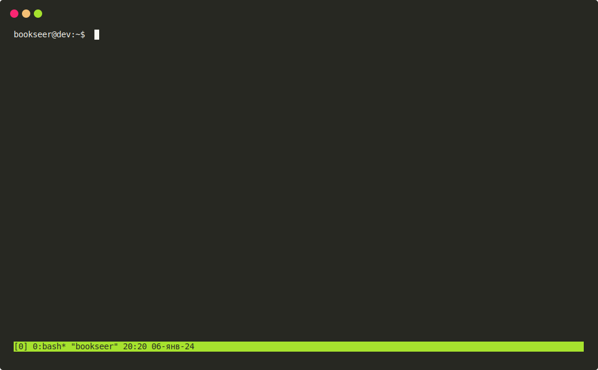
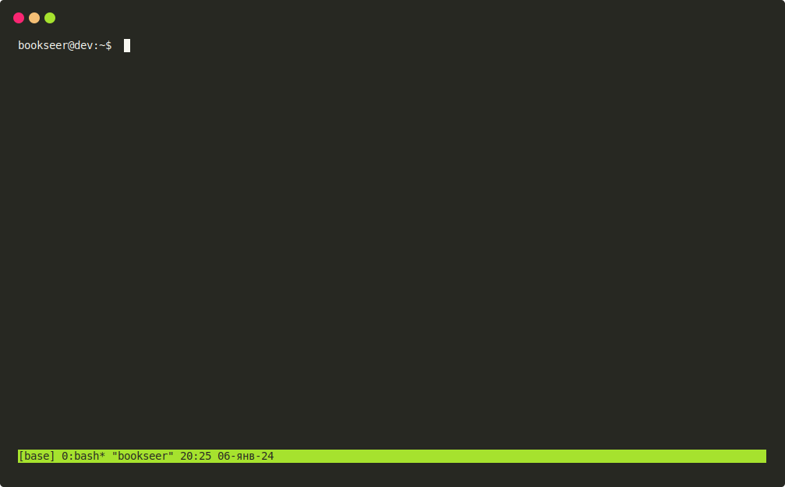

---
jupytext:
  text_representation:
    extension: .md
    format_name: myst
kernelspec:
  display_name: Python 3
  language: python
  name: python3
---

(tmux_basic)=
# Основы tmux

+++

Теперь, когда tmux установлен, рассмотрим основные его функции, начав с базового сеанса.

+++

## Запуск tmux

Самый простой способ запуска tmux --- ввести в терминале:
```console
$ tmux
```

После этого окно терминала станет похоже на следующее изображение
:::{figure-md} tmux_basic_010


Сеанс tmux по умолчанию
:::

Это «сеанс» (session) tmux, и он работает так же, как обычный терминальный сеанс.
Можно ввести любую допустимую команду, и все будет работать, как ожидалось.

Чтобы закрыть сеанс tmux, нужно ввести
```console
$ exit
```
в самом сеансе.
Это приведет к закрытию tmux, и возврату к стандартному терминалу.

Однако, такой способ запуска tmux не очень удобен для продолжительной работы, и годится лишь для кратковременных сеансов.
Если использовать tmux сколь-нибудь продолжительное время, лучше создать «именованные сеансы».
Такой способ позволит легко идентифицировать сеансы, и свободно переключаться между ними в процессе работы.

Таким образом, можно запускать на одном компьютере столько сеасов, сколько необходимо, и при желании организовывать их
по своему усмотрению.
Например, один сеанс для рабочего проекта, другой --- для собственного крутого крутого сайд-проекта.
Можно организовать эти сеансы, давая каждому собственное уникальное имя.
Это очень просто.
Следующая команда создаст именованный сеанс под названием «base»:
```console
$ tmux new-session -s base
```
Более короткий вариант этой команды выглядит так:
```console
$ tmux new -s base
```

Запуск любой из этих команд приведет к запуску «именованного сеанса» tmux.
:::{figure-md} tmux_basic_020


Именованный сеанс base
:::

Заметить различия, однако, по сравнению с предыдущим запуском, довольно сложно.
Единственное различие --- это имя сеанса в нижнем левом углу окна терминала.

Именованные сеансы удобны, когда есть необходимость оставлять tmux запущенным в фоне.

Особенности работы с сеансами tmux и способы запуска программ в фоновом режиме рассматриваются далее.
А сейчас поговорим о том, как отправлять команды в tmux.
